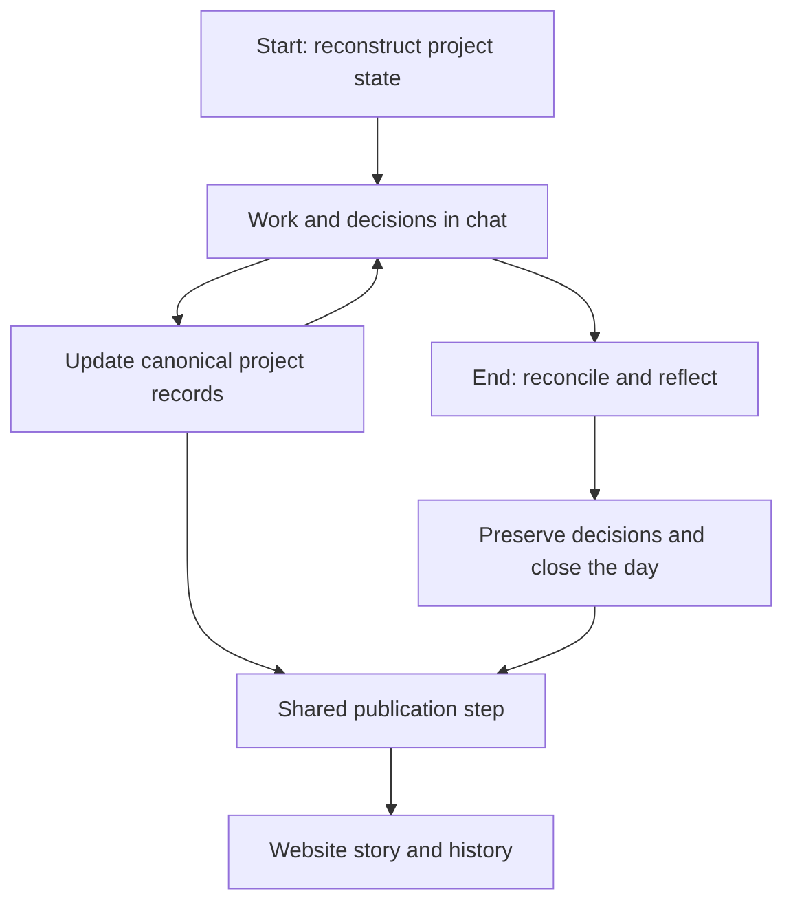

# ADR 0001: Publish through the existing daily continuity protocol

Status: approved direction, recorded 2026-09-05; implementation pending.
Scope: shared project publication architecture, extending requirements version 1.
Owner: Kazon Wilson.

## Decision

Existing daily protocol → canonical project records → shared publication step →
website story and history.

The conversational agent already owns routine roadmap/execution reconciliation.
Publication is an additional projection of that work, not another tracker,
another reflection ceremony, or a parallel continuity system.
The user works naturally in chat; agents handle the mechanical updates.
The website never becomes authoritative for project intent or acceptance.

## Concrete insertion points

Inspected Threadline's current AGENTS.md on 2026-09-05.
Its startup step 6 already maintains durable execution state as work advances.
Shutdown steps 1–4 reconcile reality; step 5 preserves meaningful reflection;
step 6 names the day; steps 7–8 provide a resumable closing summary.
Its audience-specific briefing rule already calls for projections of shared state.

| Boundary | Publication responsibility |
| --- | --- |
| Startup, after normal orientation | Read delivery receipts and recover pending work. Do not publish merely because a chat opened. |
| Work, after durable reconciliation | Publish a meaningful result, accepted direction change, or milestone transition. Suppress routine activity. |
| Shutdown, after reconciliation, reflection, and naming | Produce an audience-safe closing summary grounded in the completed ritual. Preserve the normal Day Complete response. |
| Delivery failure | Record pending delivery and resume normal work. Retry at the next protocol boundary; never claim a background retry exists unless it actually does. |

The publication step must not block or replace reflection and durable handoff.
If no meaningful public change exists, publication is a no-op.
No scheduler or continuously running observer is required for this first integration.
Updates occur when the working agent reaches the protocol boundary; this is not
a guarantee of publishing while no agent is running.

## Natural changes of direction

The agent records confirmed decisions through the existing project protocol first.
Ideas may be proposed, parked, explored, implemented, dropped, or resumed.
Exploration is not commitment. Work may have no milestone link yet.
Retain stable thread IDs across interruptions and resumes. Version meaningful
roadmap changes with their reason, without rewriting the historical plan.
Public summaries explain important changes without copying every passing thought.
Client scope and delivery promises remain subject to explicit acceptance.

## Shared ownership and transfer

The website repository owns this document, the readable-story requirements, and
the reusable publication adapter. Each project supplies only its configuration:

- project ID and supported protocol version/pinned document reference;
- canonical roadmap, execution record, and daily-summary locations;
- existing startup/work/shutdown insertion points;
- authorized audience, content policy, and approved public links;
- private delivery-state location and credential reference, never credential values.

Add a short reference in the project's existing agent instructions.
Do not copy the protocol or duplicate the roadmap in each project.
Project-private configuration stays in that project, not in this public repository.
A fresh chat reads the existing project instructions and canonical state first,
then follows the shared publication steps. Missing access must be reported,
not replaced with remembered or fabricated state.
Multiple chats must re-read current state and reconcile concurrent edits before
writing. One logical publisher identity per project does not mean one chat only.

Threadline remains the engineering evidence adapter. Its future live Observer can
enrich the same publication input. It is not required to observe this conversation
or to launch the website pilot. MCP is an optional adapter interface, not a new
source of truth or an automatic event trigger by itself.

## Publication contract and delivery

Prepare readable content from durable, source-supported state using the working
agent. The site does not need a second LLM summarization service.
Before sending, apply the configured audience policy to prose, optional technical
detail, links, and visual assets. Schema validation alone is not privacy review.
Private reflection, sensitive feedback, and raw transcripts are excluded by default.
Hold uncertain material privately; do not transmit it to public storage.

The adapter must carry stable project/update identity, source version, event date
and precision, publication kind, optional milestone/thread associations, attribution,
and approved visual references. Keep private source locators in private receipts;
public IDs must not expose private paths or repository identifiers.

Persist prepared delivery and its source identity privately before sending.
On acknowledgement, record the returned receipt. Retry the same event identity;
do not create another entry for the same source outcome.
Concurrent updates use an expected revision with an atomic acceptance operation.
On conflict, re-read canonical state and reconcile rather than force an overwrite.
Delivery order is per project, never inferred from timestamps.

The journal retains history and derives current views. It supports correction and
withdrawal, including assets and controlled caches. Withdrawal tombstones prevent
a retry or backfill from resurrecting removed content.
Client access is separate from public publication and remains disabled until
audience isolation is verified.

## Historical backfill

Backfill is part of initial project onboarding and uses the same adapter.
Prefer existing shutdown records, dated roadmap decisions, merged PRs, and
explicitly recorded feedback. Verify current source access before using it.
Inspect sensitive sources privately; publish only their permitted outcome.

1. Inventory available dated sources and record the coverage window and gaps.
2. Produce a few meaningful episodes, not an entry for every commit or test.
3. Preserve original event date/precision; record actual publication time separately.
   A known day does not justify inventing an exact time.
4. Use the same source-based identity rules as live publication. One outcome found
   in both a shutdown and PR must not become duplicate entries.
5. Reuse known milestone/thread identities without inventing historical intent,
   acceptance, previous plans, or causality from the current roadmap.
6. Label backfilled entries. An older event arriving later belongs in historical
   order and must not replace today's current project state.
7. Use actual dated visuals where available. New concepts remain labeled concepts.
8. Record backfill receipts and coverage so reruns fill gaps without duplication.
   Reconcile historical withdrawals before publishing anything again.

## Website and implementation boundaries

Reuse the existing Astro/Cloudflare website with one shared publication API.
The homepage previews projects; /building shows the journal; /building/[project]
shows goal, intended experience, working-today evidence, roadmap, history, and next step.
Project records remain the authority; the journal is a presentation history.

D1 is the proposed transactional journal implementation. This approved workflow
does not silently finalize the database schema, retention durations, credential
provisioning, or private-client access design. Resolve those in a small implementation
contract before replacing the prototype's storage. Do not reopen the settled
question of a parallel continuity system.

PR #6's KV read/check/write cannot enforce atomic per-project history and must be
replaced or superseded. PR #7's rendering can be reused after adapting it to the
journal and truthful empty/stale/withdrawn states. Neither PR alone delivers this ADR.

## Implementation sequence and acceptance

| Slice | Demonstration required |
| --- | --- |
| 1. Shared adapter and journal contract | Atomic per-project ordering, source deduplication, history/current separation, corrections, withdrawals, and retry receipts |
| 2. Threadline ritual integration | Ordinary work and shutdown produce prepared updates without an extra user instruction; failed delivery preserves handoff |
| 3. History and project story | Verified backfill and live updates coexist without duplication or current-state regression; visuals distinguish concepts from evidence |
| 4. Transfer check | Fresh chat in a second configured project follows its existing ritual and uses the same adapter without a copied protocol |

Keep slices independently reviewable. Test interruption/resume, midstream reprioritization,
simultaneous chats, duplicate delivery, old backfill after new live work, and withdrawal
followed by replay. Publication success requires a confirmed receipt and verified
website output. Until then, report prepared, pending, or blocked accurately.
