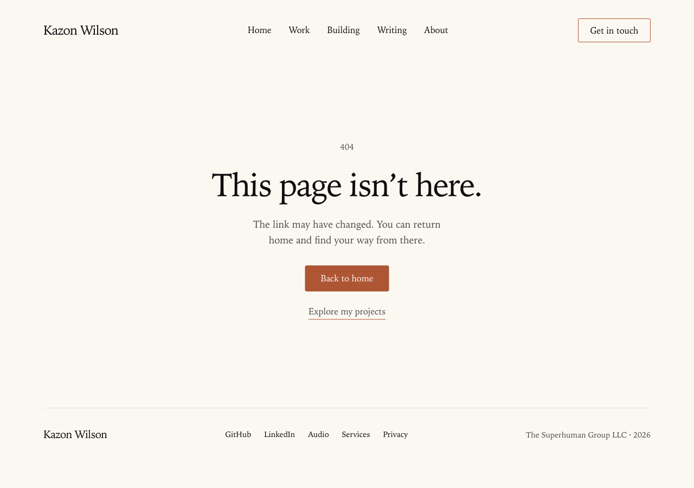
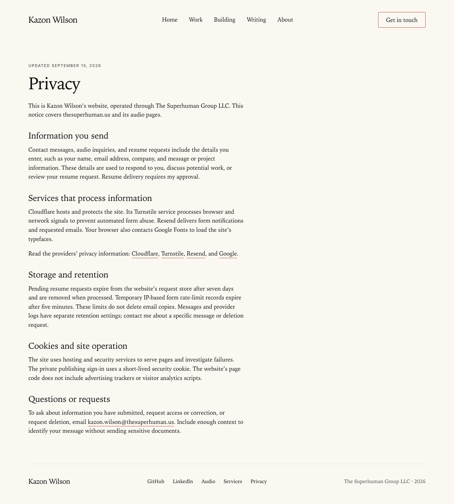

# Pre-launch readiness QA

## Scope

Adds a branded missing-page response, privacy notice and links, browser icons, canonical/sitemap corrections, and a reusable deployment checklist. Preserves the existing design and hero CTA. No production deployment or messages sent.

## Validation

The initial local implementation passed 200 unit tests, Astro checks, production build and the existing 28-file image review gate. Browser checks covered 15 routes at four widths, 18 intercepted form-response scenarios, keyboard navigation and 64 internal link targets. These are local checks, not proof of live email delivery or deployment.

## Release checks remaining

- Built Worker preview: the installed Cloudflare adapter does not support Astro preview. The preview script now uses Wrangler local mode, but the original machine encountered a dependency-resolution failure.
- Confirm live form/verification delivery using authorized test destinations, monitoring, hosting headers and alternate-host routing.
- Complete mobile performance measurement, additional browser/device coverage and operator review of retention/privacy settings.
- Obtain a go-live decision, preserve rollback, and verify the deployed revision.

See [the reusable checklist](prelaunch-checklist.md) for the complete release gate.

## PR branch verification

Rebased the scoped changes onto current main. Astro checks and the production build pass. The branch passed 203 unit tests before review; a new canonical-alias regression case was added during review. Static 404 navigation now uses absolute main-site destinations so it remains usable from the alternate audio host. Final counts and screenshots are recorded in the PR.

Final branch validation: **204 unit tests pass**, Astro check reports zero errors/warnings (three existing hints), build and asset QA pass. Generated 404 links were checked for absolute cross-host destinations.

### Visual review

## 404 visual direction

The final revision follows the owner-approved goal of a peaceful, reassuring experience: familiar typography, generous space, a plain explanation and one primary way home. Removed the decorative route illustration and oversized error-code artwork. Desktop (1280px) and mobile (390px) screenshots above reflect this revision. HTTP 404, Astro checks and the production build were reverified.
