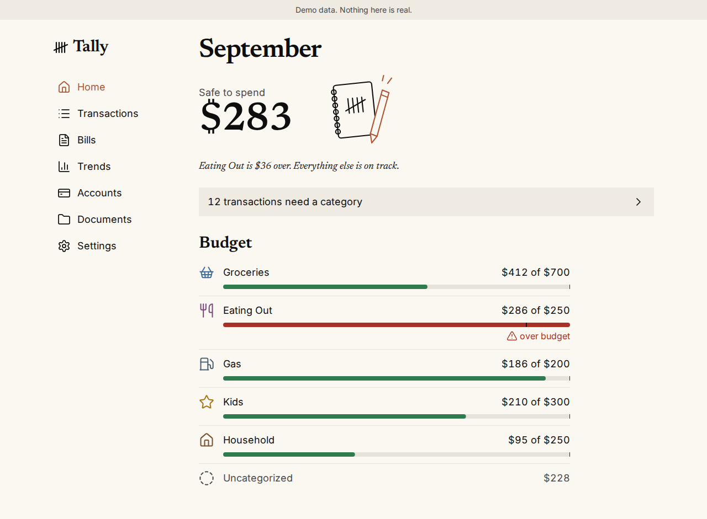

# Sample entry: Tally Home screen (new work)

Source: Tally PR #41 "feat: Home screen", merged 2026-09-23.
Intent sources: spec §2 rule 6 and §8 (Home), design studies rounds 3 and 4,
Phase 1c-1 plan, decisions 20 and 24.
Media: CI capture from `screenshots:pr-41/acde0f5/home-desktop.png` (the PR's
last screenshot run), seeded demo data.

## Review gate

Private review note: `tally-home-screen` (tier `shipped`). The draft below shows the
entry as it would read **after** the owner verifies the note; the note itself stays
in the private repository. The public copy depends on these answers:

| Public claim | Note answer | If unverified |
| --- | --- | --- |
| Home leads with safe to spend, the status sentence and the category band | 1. What changed | Hold the entry (core claim) |
| Code does the math and writes the sentence; AI only suggests categories | 2. How it works | Drop that sentence |
| "The question my family actually asks"; studies felt sterile | 3. Why this approach | Drop the motive; keep the outcome |
| "Built, not yet live" | 5. Status at the time | Hold the entry (status is core) |

Answer 4 (misuse and failure cases) informs the owner's review only. No public
claim uses it, and this public sample does not preview it.

## As it would appear on /building/tally



*Browser capture · demo data · PR #41 at acde0f5 · September 23, 2026*

**Home screen · Built, not yet live**

### Answer one question first: how much is safe to spend?

I wanted Tally's first screen to answer the question my family actually asks.
Home now leads with one number, safe to spend this month, followed by a sentence
that says what is off track and a single prompt for the transactions that still
need a category.

**Why it looks this way**

The first design studies were calm but felt sterile, so I kept their layout and
added character: a tally-mark signature, an icon for each category and a small
line drawing. The numbers stay out of AI's hands. Code does the math and writes the
status sentence; AI only suggests categories, and people decide. A bar turns red
only when a category is over, and the color always comes with an icon and words.
It goes public when the demo launches at the end of Phase 1.

[Pull request #41](https://github.com/kwilson21/tally/pull/41) ·
[Design decisions](https://github.com/kwilson21/tally/blob/main/docs/decisions.md)

## As data (`src/data/project-stories/tally.ts`)

```ts
{
  id: 'tally-home-screen', day: '2026-09-23',
  title: 'Answer one question first: how much is safe to spend?', status: 'Home screen · Built, not yet live',
  summary: 'I wanted Tally’s first screen to answer the question my family actually asks. Home now leads with one number, safe to spend this month, followed by a sentence that says what is off track and a single prompt for the transactions that still need a category.',
  detailLabel: 'Why it looks this way',
  detail: 'The first design studies were calm but felt sterile, so I kept their layout and added character: a tally-mark signature, an icon for each category and a small line drawing. The numbers stay out of AI’s hands. Code does the math and writes the status sentence; AI only suggests categories, and people decide. A bar turns red only when a category is over, and the color always comes with an icon and words. It goes public when the demo launches at the end of Phase 1.',
  artifacts: [artifact(homeDesktop, 'Home · Desktop', 'Seeded demo data for a fictional household. Captured by CI from PR #41 at acde0f5.', 'Browser capture · demo data')],
  links: [
    { label: 'Pull request #41', href: 'https://github.com/kwilson21/tally/pull/41' },
    { label: 'Design decisions', href: 'https://github.com/kwilson21/tally/blob/main/docs/decisions.md' },
  ],
}
```

## Drafting notes for the owner

- "The question my family actually asks" is inferred from spec §1 and §8, so the
  private note leaves answer 3 `unverified` until the owner confirms or corrects it.
- The phone capture from the same run is full-page, so the fixed tab bar covers
  the Budget list mid-page. The build would recapture it at viewport height
  rather than publish that version.
